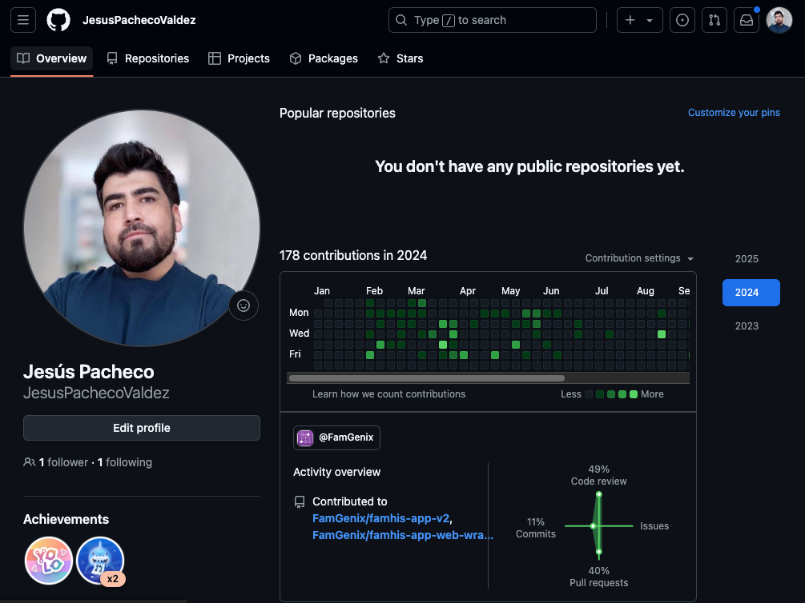
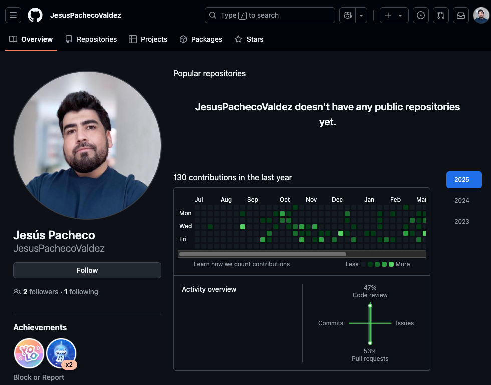

# 👋 Hi, I'm Jesús Pacheco Valdez

#### Software Engineer | React, React Native, TypeScript

🌍 Based in Atotonilco el Alto, Jalisco, Mexico  
💻 Passionate about building high-impact and user-focused products  

---

## 👨‍💻 About Me

I'm an accomplished React Native Software Developer with over three years of experience at FamGenix, specializing in Front-End Development to create dynamic and user-focused applications. With a background in Electrical and Electronics Engineering from Instituto Tecnológico de Ciudad Guzmán, I thrive on collaborating with cross-functional teams to deliver scalable solutions.

Previous roles as a Student Software Developer and IT Support Technician at AT&T have honed my problem-solving skills and ability to offer robust technical support. I am dedicated to learning, growing, and contributing to meaningful projects through teamwork and innovation.

---

## 🚀 Skills

- **Front-End Development**: React.js, React Native, Next.js, TypeScript, JavaScript, CSS Flexbox, HTML  
- **State Management**: Redux.js  
- **Version Control**: Git, GitHub  
- **Other**: Teamwork, Problem Solving

---

## 💼 Experience

- **React Native Software Developer**
  - *FamGenix - Full-time (Remote)*
  - May 2022 – May 2025

- **IT Support Technician**
  - *AT&T - Full-time*
  - Jul 2017 – Aug 2020 (Guadalajara, Jalisco, Mexico)

## 📈 FamGenix Contributions

Here’s a snapshot of my recent contribution activity for FamGenix:

**2024**

**2025**

---

## 📫 Let's Connect

- LinkedIn: [Jesús Pacheco Valdez](https://www.linkedin.com/in/jes%C3%BAs-pacheco-valdez-174916172/)
- Email: pacheco1290@gmail.com
